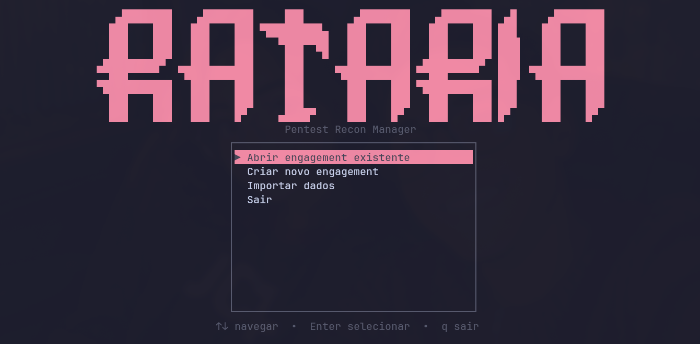

<div align="center">


<br/>
<br/>


<br/>
<br/>


<br/>
<br/>

> **TUI para gerenciamento de alvos em Pentest, Red Team e Bug Bounty.**  
> Organiza subdomains, IPs, ASNs, URLs, tecnologias e screenshots em um banco local criptografado.

</div>

---

 

## ✨ Funcionalidades

| Feature | Descrição |
|---------|-----------|
| 🎯 **Multi-engagement** | Gerencie múltiplos alvos e programas simultaneamente |
| 🔐 **Banco criptografado** | SQLite + SQLCipher com AES-256, protegido por senha master |
| ⏱️ **Timeout de sessão** | Banco fecha automaticamente após 5 minutos de inatividade |
| 📥 **Importação flexível** | Aceita JSON da ratazana, JSON genérico ou TXT simples |
| 📄 **Exportação MD** | Gera relatório Markdown completo do engagement |
| 🖼️ **Preview screenshots** | Visualização inline via protocolo Kitty |
| 🧪 **TDD** | 219+ testes cobrindo toda a camada de dados |
| ✅ **Confirmação de delete** | Modal de confirmação antes de qualquer exclusão |

---

## 🏗️ Arquitetura

```
rataria/
├── src/
│   ├── main.rs           ← loop principal da TUI
│   ├── app.rs            ← estado global da aplicação
│   ├── error.rs          ← tipos de erro
│   ├── export.rs         ← exportação para Markdown
│   ├── db/
│   │   ├── mod.rs        ← conexão SQLite + SQLCipher
│   │   ├── migrations.rs ← schema do banco
│   │   ├── models.rs     ← structs de dados
│   │   └── queries.rs    ← queries testadas (TDD)
│   ├── auth/
│   │   └── crypto.rs     ← Argon2id + zeroize
│   ├── import/
│   │   ├── ratazana.rs   ← parser do JSON da ratazana
│   │   ├── generic.rs    ← JSON genérico + TXT
│   │   └── report.rs     ← relatório de importação
│   └── ui/
│       ├── dashboard.rs  ← visão geral do engagement
│       ├── subdomains.rs ← listagem com status e filtros
│       ├── screenshots.rs← preview via Kitty
│       └── ...           ← demais telas
```

---

## 🚀 Instalação

### Dependências

```bash
# Arch Linux
sudo pacman -S base-devel clang

# Ubuntu/Debian
sudo apt install build-essential libclang-dev clang
```

### Compilar e rodar

```bash
git clone https://github.com/bielzaoo/rataria
cd rataria
cargo build --release
./target/release/rataria
```

> ⚠️ A primeira compilação pode demorar alguns minutos — o SQLCipher é compilado junto.

---

## 🖥️ Fluxo de uso

```
Senha Master
    └── Home
         ├── Criar Engagement
         ├── Abrir Engagement
         │    └── Dashboard
         │         ├── Targets
         │         │    ├── Subdomains
         │         │    │    ├── URLs
         │         │    │    ├── Technologies
         │         │    │    └── Screenshots (preview Kitty)
         │         │    ├── IPs
         │         │    └── ASNs
         │         └── [E] Exportar MD
         └── Importar dados
```

---

## ⌨️ Atalhos

### Globais

| Tecla | Ação |
|-------|------|
| `?` | Ajuda contextual |
| `Esc` | Voltar / Cancelar |
| `q` | Sair (na tela inicial) |

### Subdomains

| Tecla | Ação |
|-------|------|
| `N` | Novo subdomain |
| `S` | Ciclar status (`not-visited` → `in-progress` → `reviewed` → `vulnerable` → `false-positive`) |
| `O` | Editar notas |
| `F` | Filtrar por status |
| `D` | Deletar (pede confirmação) |
| `Enter` | Abrir menu do subdomain |

### Dashboard

| Tecla | Ação |
|-------|------|
| `E` | Exportar relatório Markdown |

### Screenshots

| Tecla | Ação |
|-------|------|
| `Enter` | Preview inline (requer Kitty) |
| `O` | Abrir com visualizador do sistema |

---

## 📥 Formatos de importação

O Rataria detecta o formato automaticamente pelo conteúdo do arquivo.

### TXT simples

Um subdomain por linha. Linhas com `#` são ignoradas.

```
# gerado pelo subfinder
api.empresa.com
admin.empresa.com
dev.empresa.com
```

> Para TXT, informe o **Target** e o **Engagement** na tela de import.

---

### JSON genérico

Formato mínimo:

```json
{
  "target": "empresa.com",
  "subdomains": ["api.empresa.com", "admin.empresa.com"]
}
```

<details>
<summary>📋 Formato completo (clique para expandir)</summary>

```json
{
  "target": "empresa.com",
  "engagement": "Bug Bounty Q1",
  "subdomains": [
    {
      "subdomain": "api.empresa.com",
      "status_code": 200,
      "title": "API Principal",
      "technologies": [
        { "name": "Nginx", "version": "1.24" },
        { "name": "React", "version": null }
      ],
      "urls": [
        { "url": "https://api.empresa.com/v1/users",  "url_type": "endpoint" },
        { "url": "https://api.empresa.com/app.js",    "url_type": "javascript" },
        { "url": "https://api.empresa.com/search?q=", "url_type": "parameter" }
      ]
    },
    "dev.empresa.com"
  ],
  "ips": ["192.168.1.1"],
  "asns": [
    { "asn": "AS12345", "org": "Empresa XPTO Ltda" }
  ]
}
```

</details>

**Campos disponíveis:**

| Campo | Tipo | Obrigatório | Descrição |
|-------|------|:-----------:|-----------|
| `target` | string | ✅ | Domínio principal |
| `engagement` | string | ❌ | Nome do engagement |
| `subdomains` | array | ✅ | Strings simples ou objetos completos |
| `ips` | array | ❌ | Lista de IPs |
| `asns` | array | ❌ | Lista de ASNs com org opcional |

**Tipos de URL:** `endpoint` · `javascript` · `parameter` · `other`

---

### JSON da Ratazana

Se você usar a [ratazana](https://github.com/seu-usuario/ratazana) para recon automatizado, o output já está no formato correto. O Rataria detecta automaticamente pelo campo `rataria_version`.

<details>
<summary>📋 Exemplo do formato ratazana (clique para expandir)</summary>

```json
{
  "rataria_version": "1.0",
  "target": "empresa.com",
  "engagement_name": "Bug Bounty Q1",
  "timestamp": "2025-04-24T10:00:00Z",
  "subdomains": [
    {
      "subdomain": "api.empresa.com",
      "status_code": 200,
      "title": "API Principal",
      "technologies": [{ "name": "Nginx", "version": "1.24" }],
      "urls": [{ "url": "https://api.empresa.com/v1/login", "url_type": "endpoint" }],
      "sources": ["subfinder", "httpx"]
    }
  ],
  "ips": ["192.168.1.1"],
  "asns": [{ "asn": "AS12345", "org": "Empresa XPTO Ltda" }]
}
```

</details>

---

## 🔐 Segurança

- Banco criptografado com **SQLCipher + AES-256**
- Senha derivada via **Argon2id** (resistente a brute force)
- Chave nunca escrita em disco — apenas em memória
- Memória zerada via **zeroize** ao encerrar
- **Timeout de sessão** de 5 minutos por padrão
- Confirmação antes de qualquer exclusão

---

## 📁 Dados

```
~/.local/share/rataria/rataria.db       ← banco criptografado
~/rataria_<engagement>_<timestamp>.md   ← relatório exportado
```

> ⚠️ Sem recuperação de senha. Se perder a senha master, o banco não pode ser aberto.  
> Faça backup do arquivo `.db` regularmente.

---

## 🤝 Ecossistema

| Ferramenta | Descrição |
|------------|-----------|
| **rataria** | Esta ferramenta — TUI de gerenciamento |
| **[ratazana](https://github.com/bielzaoo/ratazana)** | CLI de recon automatizado — gera o JSON para importar aqui (Future) |

---

## 📄 Licença

MIT © 2025
